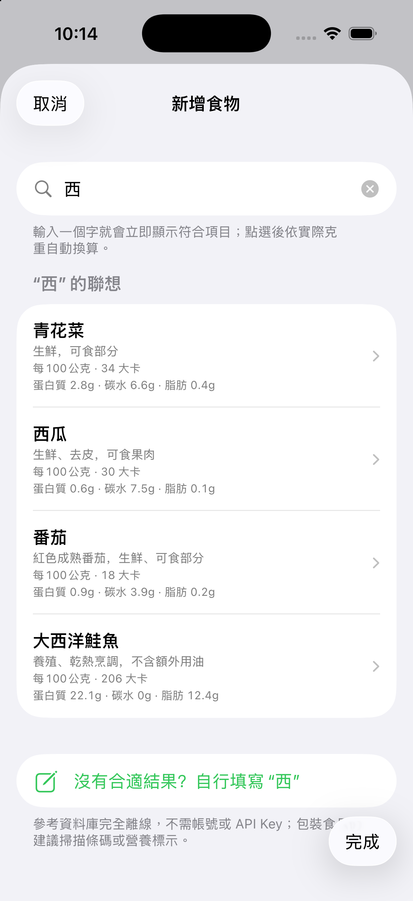
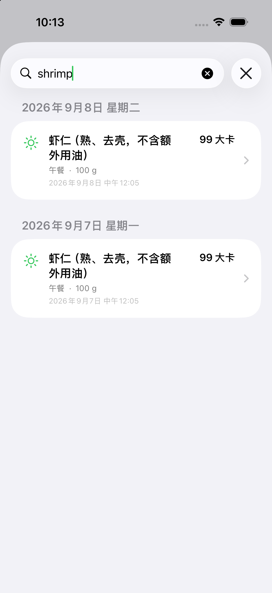

# 减重助手 (WeightCoach)

一个可自行设定目标的 iOS 营养、运动与体重管理 App。

[公开版安装、独立签名、App Group 与私有桥接配置指南](docs/COLLEAGUE_SETUP.md)

[繁體中文快速開始](docs/QUICKSTART.zh-Hant.md) · [已有项目如何更新](docs/COLLEAGUE_SETUP.md#9-更新已有安装与签名到期)

## 当前公开版（2026-09-26 核对）

当前 `main` 已包含食物历史复用与任意比例、三语搜索、常吃快捷记录、运动补记与去重、营养趋势，以及私有 AI 桥接的连接修复。最近的手机签名续期不涉及功能代码变更，也不会把作者的签名、个人数据或服务配置发布到这里。

本轮更新补充了繁体上手指南、保留数据的更新方式与签名到期说明。功能交互的已有验证记录见 [2026-09-09 验收说明](docs/QA_2026-09-09.md)；后续核对记录见 [2026-09-26 同步说明](docs/SYNC_2026-09-26.md)。

朋友可以直接从本公开仓库获取完整源码，自行修改、构建和签名：

```bash
git clone https://github.com/xjtuyanshi/WeightCoach-Public.git
cd WeightCoach-Public
open WeightCoach.xcodeproj
```

首次运行会引导填写自己的身体资料与目标。无需 AI 桥接也能使用常见食物搜索、手动记录、历史复用、商品条码和本机营养标签 OCR；AI 图片识别与一句话补记需另行配置自己的 Mac mini。公开源码不附带可直接安装的已签名 iPhone App。

- 从 **Apple 健康** 读取体重、体脂率、身高、年龄、性别、活动能量
- 动态计算每日总消耗（TDEE）和减重所需热量缺口，实时显示 **今天还能吃多少千卡**
- 五种饮食记录方式：**一句话补记**、**极速拍照 / 账单识别**（可选 Mac mini 私有桥）、**扫商品条形码**（优先本地缓存 / Open Food Facts，查不到可直接本机 OCR 扫包装营养表）、**搜索常见食物**、**手动输入**
- 鸡蛋、香蕉、苹果等常见食物提供“半个 / 一个 / 大小”等标准份量与可食部分克重参考，也可随时改成实际克重
- 首页按最近 30 天自动整理“常吃与最近”：跨至少两天吃过的食物优先显示；有六种可用食品时会填满六张卡片，不再遗漏前四名之外的常吃。可按上次份量一键记录与撤销
- **从历史记录添加**可搜索任意日期吃过的食物，不限最近 30 天；参考库食物可用简体、繁体或英文名称与别名搜索旧记录。支持输入 `0.75`、`3/4` 等自定义比例，按同一比例换算热量和已有营养素后添加到指定餐次
- 常见食物搜索预先建立三语索引，历史搜索缓存参考库名称和别名，减少逐字输入时重复处理语言资源；自定义菜名仍按原文搜索，不会猜测翻译或改写历史记录
- 体重 / 体脂趋势图、目标轨迹对比、按当前速度预计达成日期
- 7 / 30 天热量、缺口与蛋白质 / 碳水 / 脂肪趋势，本周缺口统计截至昨天
- 不戴手表时可补记篮球、跑步、走路或力量训练，调整开始时间、时长和强度，并随时删除；与 Apple 健康活动能量及同类运动记录核对后，只补未覆盖的部分，避免第三方运动 App 重复累计
- App、通知和小组件支持跟随系统、简体中文、繁體中文和 English
- 记录的体重和饮食热量会回写到 Apple 健康

## 首次运行

最近一次功能改动的构建、单元测试及真实模拟器点击记录见 [2026-09-09 验收说明](docs/QA_2026-09-09.md)。

<p>
  
  
</p>

1. **同意 Xcode 许可**（本机还没同意过，编译前必须做一次）：
   ```bash
   sudo xcodebuild -license accept
   ```
2. 用 Xcode 打开 `WeightCoach.xcodeproj`。
3. 在 target **WeightCoach → Signing & Capabilities** 里选择你自己的 Team（真机运行需要；HealthKit 能力已配置好）。
4. 选择你的 iPhone 运行（HealthKit 数据在真机上才完整；模拟器里健康数据为空，可用手动记录测试）。
5. 首次启动会请求 **健康数据授权**；首次拍照时再申请 **相机权限**。
6. 拍照、压缩、结果核对和营养记录都在 App 内完成，不会跳转到 ChatGPT，也不在 App 内保存 API Key。若要启用真实自动识别，请按 [Mac mini 私有桥接指南](docs/BRIDGE_SETUP.md) 填写每位使用者自己的 HTTPS 私有地址；未配置时照片不会上传，仍可使用常见食物、条码、包装 OCR 和手动录入。

模拟器可用下面的启动参数检查完整的极速拍照交互（结果明确标记为演示数据）：

```bash
xcrun simctl launch <UDID> com.lukegogogo.WeightCoach -demoData -demoCapture
# 一句话补记：自动填入示例 → AI 估算 → 逐项核对 → 选择日期和餐次
xcrun simctl launch <UDID> com.lukegogogo.WeightCoach -demoData -demoSentenceBackfill
# 包装营养表：演示 OCR → 核对标橙字段 → 缓存商品 → 选择食用量
xcrun simctl launch <UDID> com.lukegogogo.WeightCoach -demoData -demoNutritionLabel
# 7 / 30 天趋势与本周缺口演示
xcrun simctl launch <UDID> com.lukegogogo.WeightCoach -demoData -demoTrends
# 常见食物标准份量：预选一个大号水煮蛋
xcrun simctl launch <UDID> com.lukegogogo.WeightCoach -demoData -demoCommonFood
# “常吃与最近”排序、标签和一键再记
xcrun simctl launch <UDID> com.lukegogogo.WeightCoach -demoData -demoRepeatFoods
# 全部历史记录与任意比例（包含 45 天前的虚构记录）
xcrun simctl launch <UDID> com.lukegogogo.WeightCoach -demoData -demoHistoryFoodRepeat
# 六种跨日常吃填满卡片，以及简繁英文参考库历史搜索
xcrun simctl launch <UDID> com.lukegogogo.WeightCoach -demoData -demoFrequentOverflow
# 第三方运动与 Apple 健康去重
xcrun simctl launch <UDID> com.lukegogogo.WeightCoach -demoData -demoThirdPartyExercise
```

包装营养表识别由 Apple Vision 在设备上完成，支持常见中英文标签、kJ 转千卡、每份 / 每 100 克 / 每 100 毫升 / 整包 / 每个以及基础双列标签。`%DV` 不会被当成营养含量；低置信或近似值必须人工核对。确认后的商品会按条码保存在 SwiftData，之后重复扫码直接进入食用量页面。原始标签照片不会保存或上传。

餐厅账单或菜单识别不会把账单照片保存为饮食缩略图，也不会把整单默认算成一个人吃完。保存前必须选择整单、1/2、1/4、3/4，或逐项核对实际吃到的内容。单张照片无法可靠测量重量、隐藏烹调油或所有定制项，所有 AI 结果都应在 App 内确认。

一句话补记会把饮食描述发送到每位使用者自己配置的 Mac mini 私有桥，再由 Mac mini 使用已登录的 ChatGPT 会话进行云端估算；App 不包含 API Key，也不会跳转到 ChatGPT。日期和餐次只由 App 中的选择决定，AI 结果不会自动保存，必须单独核对日期 / 餐次并逐项核对名称、份量和热量后才会写入 App 与 Apple 健康。核对后若再编辑名称、份量或热量，确认会自动失效，旧的派生营养值也会清空，避免保存互相矛盾的数据。关闭页面或重新估算时，App 还会用不含原文的请求 ID 通知 Mac mini 终止旧任务，避免继续占用订阅额度和单任务识别槽。

Mac mini 桥接默认使用独立的 HTTPS `8443` 端口，可与同一台 Mac 的 `443` 服务共存。安装器会检测端口冲突，遇到其他服务则停止；请把安装完成后显示的完整地址（含 `:8443`）填入 App。首次启用、升级或重新安装后，可在“设置 → AI 识别”保存并检测连接。详见 [桥接部署与排错](MacMiniBridge/README.md)。

## 热量计算逻辑

- **基础代谢（BMR）**：有体脂率时用 Katch-McArdle 公式（按瘦体重），否则用 Mifflin-St Jeor。
- **每日总消耗（TDEE）**：默认（计入手表活动能量）= BMR × 1.1（食物热效应）+ Apple Watch 实测全天活动能量——实测值**替代**活动系数而非叠加，避免把日常活动算两遍；预算随当天活动量实时增长。关闭手表模式则 = BMR × 活动系数。
- **每日缺口**：公开版默认按目标日期动态调整，计算为剩余公斤数 × 7700 ÷ 剩余天数，并限制在 250–1000 千卡；也可主动选择固定 750 千卡的“尽快减脂”模式，达到目标体重后计划缺口归零。两种模式都受下方摄入量下限约束。
- **今天还能吃** = TDEE − 缺口 − 已摄入，且预算不低于男 1500 / 女 1200 千卡的安全底线。

> 估算仅供参考，不构成医疗建议。

步数和活动能量是不同数据。手机有步数但 Apple 健康没有对应活动能量时，App 会提示补记，不会直接把步数再次折算并加到预算。运动核对失败时会提供重试，避免在数据不完整时叠加估算消耗。

## 代码结构

```
WeightCoach/
├── WeightCoachApp.swift        # 入口，SwiftData 容器
├── Models/                     # FoodEntry / WeightEntry (SwiftData)、ProfileStore（档案与目标）
├── Health/HealthKitManager.swift  # 健康数据读写
├── Engine/CalorieEngine.swift  # BMR / TDEE / 缺口 / 预测
├── Services/                   # 可替换识别端、图片准备、本地营养表 OCR/解析、商品写入/缓存
└── Views/                      # 今日仪表盘、饮食记录、体重趋势、设置
```

## 隐私与许可

- 仓库使用全新的公开历史，不包含原开发仓库的提交记录、私人桥接地址、健康数据或内部审查会话。
- `-demoData` 注入的体重、饮食与运动记录均为虚构演示数据。
- 不要提交 `WeightCoach/BridgeConfigLocal.plist`、API Key、访问令牌、个人服务 URL、健康数据导出或真机日志。
- USDA FoodData Central 与 Open Food Facts 的数据许可和归属见 [第三方数据说明](THIRD_PARTY_NOTICES.md)。
- 本项目按 [MIT License](LICENSE) 开源。
